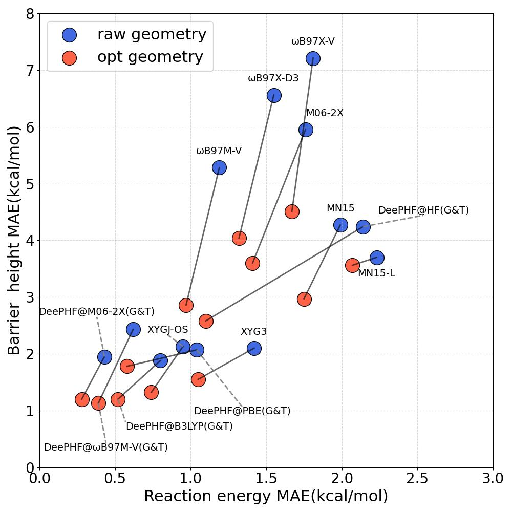
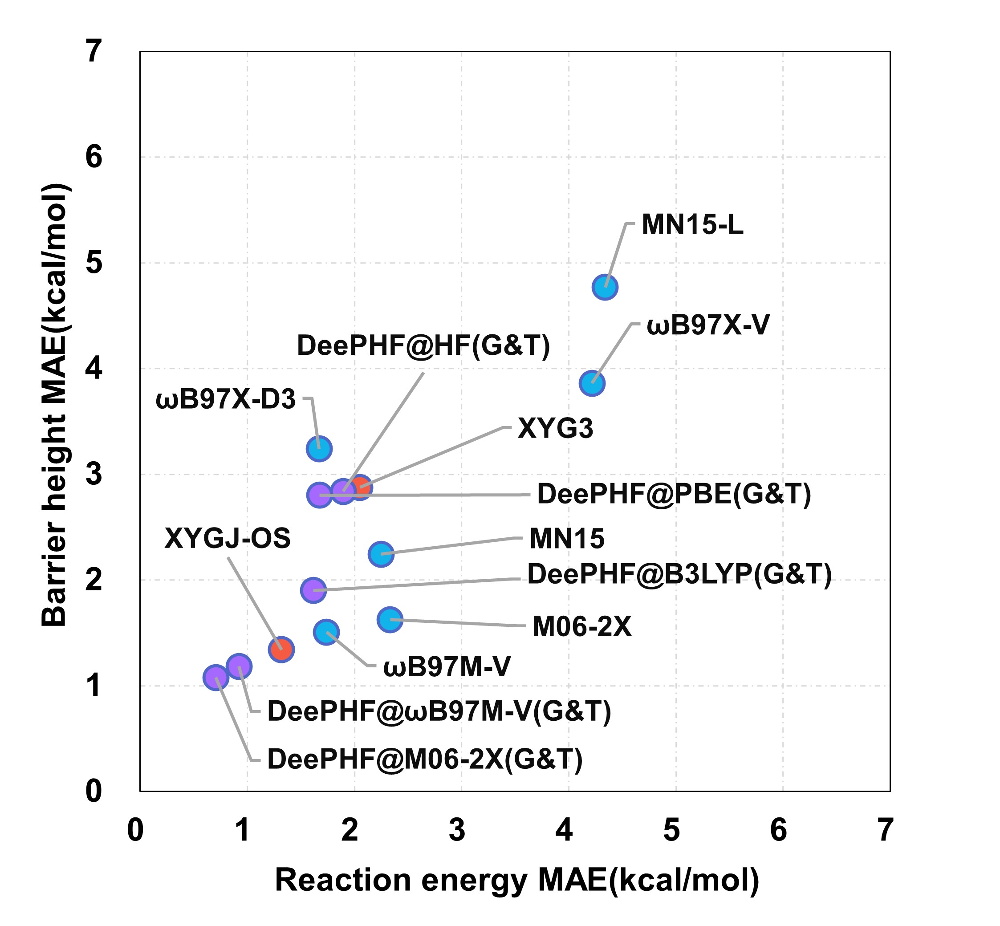

# A Deep Learning-Augmented Density Functional Framework for Reaction Modeling with Chemical Accuracy

This manual will tell you how to train and test with you datasets. The detail datasets can be found in zenodo.
## Install Requirements
Install package version
```python
python==3.9.0
pyscf==2.2.1
torch==2.0.0
ruamel.yaml==0.17.21
numpy==1.24.2
scipy==1.10.1
paramiko==3.1.0
```
Then we will install package [DeePKS-kit](https://github.com/deepmodeling/deepks-kit).
DeePKS-kit is a pure python library so it can be installed following the standard `git clone` then `pip install` procedure. Note that the two main requirements `pytorch` and `pyscf` will not be installed automatically so you will need to install them manually in advance. Below is a more detailed instruction that includes installing the required libraries in the environment.

We use `mamba` here as an example. So first you may need to install [Miniforge](https://github.com/conda-forge/miniforge). and install the requirement package.
```
mamba create -n deepks python=3.9.0 paramiko=3.1.0 numpy scipy=1.10.1 h5py ruamel.yaml=0.17.21 paramiko=3.1.0
mamba activate deepks
pip install torch==2.0.0 torchvision==0.15.1 torchaudio==2.0.1
pip install pyscf==2.2.1
```
Then you can install deepks
```
git clone https://github.com/deepmodeling/deepks-kit
cd deepks/
python setup.py install
```
or you can install
```
pip install git+https://github.com/deepmodeling/deepks-kit/
```
## Train our datasets
you can download our examples datasets from [zenodo.14876882](https://zenodo.org/records/14876882)
The datasets is Below,  `QM` document contain the each type DFT training parameters`train_input.yaml` and datasets path such as `train.raw`, and `get_energy.py` will give you output energy.

`test_sets` also have contain the "eigenvaleu of local density matrix" of test sets and the end reults

`validate_sets` only contain the results


 ```python
projects
├── QM
│   ├── B3LYP
│   │   ├── GRAM
│   │   ├── GRAMandT1X
│   │   └── T1X
└── validate_sets
    └── WHG_BHRE
        └── result
 ```
### Train
we use the `DeePHF@B3LYP` as a example.
```
cd QM/B3LYP/GRAMandT1X
deepks train train_input.yaml  -d train.raw -t valid.raw -o model.out/model.pth > model.out/log.iter 2> model.out/err.iter
```
### Test
```
## you can check the test.raw error
deepks test -m model.out/model.pth -d test.raw -o test_corr/test >L1L2.out

## or you can use `get_energy.py` get the output `energy`, for example
python get_energy.py --model models/wb97M-V/GRAMandT1X/model.out/model.pth --raw RGD1_opt_wb97mv.raw
```
generate the `dm_eig.npy` from xyz file.
```
deepks scf scf_input.yaml -m None -s xyzfile/test.xyz -X M06-2X -d result/
```


## Results
<div align="center">
  
  <p>Model performance was evaluated on independent test sets RGD1 database(83 reactions)</p>
</div>


<div align="center">
  
  <p>Model performance was evaluated on independent test sets BH9 database(97 reactions) </p>
</div>

## Future usage, a useful example. 
you can use the model to generate the energies which are close to CCSD(T)-F12a, and improve your model accuracy. you can find the results in https://doi.org/10.26434/chemrxiv-2025-1d293-v2


